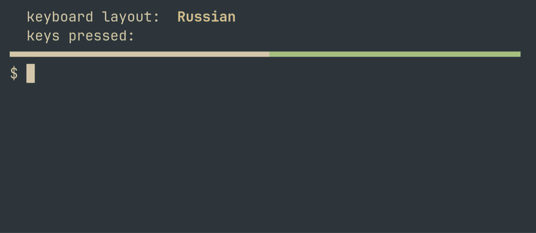

# password-layout

[](https://github.com/yesm1ke/password-layout/releases/latest)
[](https://github.com/yesm1ke/password-layout/actions/workflows/ci.yml)

Makes typing a password painless when you write in more than one language:
while you type a password the keyboard layout is Latin. If the current layout is
not Latin, the one you used last is switched to, and your layout comes back when
the password is done. For [Hyprland](https://hyprland.org/) with fcitx5;
developed and tested on [Omarchy](https://omarchy.org/), where both come out of
the box.

If you type in a non-Latin layout, you know the routine: `sudo` asks for a
password, you type it blind, it is rejected, and only then do you notice the
layout was wrong.



## The rule

The logic is the one macOS users are used to: in a password field only Latin
layouts are allowed, and the switch there and back happens by itself.

- if the active layout is already Latin, nothing changes — German stays German;
- otherwise the Latin layout that was last in use is switched to, or the first
  Latin one if none has been used yet;
- when the password is done, the layout that was active before comes back.

A layout is Latin if it types the letters a–z: German, Dvorak or Esperanto are;
Russian, Urdu or `us(rus)` are not ([how this is
measured](https://github.com/yesm1ke/password-layout/wiki/Which-layouts-count-as-Latin)).

Only keyboard layouts are switched. Input methods in fcitx5 (Pinyin, Mozc and
the like) are left alone, and other programs are not kept from reading the
keyboard.

## What works today

- **Terminals**: password prompts of `sudo`, `ssh`, `read -s`, and anything else
  that reads a password the way `getpass` does. Any terminal emulator (tested in
  Ghostty and foot); tmux panes too.
- **Graphical applications**: password fields that are marked for the input
  method, through an addon for fcitx5. Zen (Firefox-based) and Chromium do
  this; Qt applications too, with one bug in fcitx5-qt
  ([#7](https://github.com/yesm1ke/password-layout/issues/7)). Electron password
  managers are not checked yet ([#8](https://github.com/yesm1ke/password-layout/issues/8)).

The scope is deliberately narrow: one person at a real keyboard in a Hyprland
session. Virtual consoles, the boot and disk-unlock screens, remote machines and
other compositors are out of scope.

## Requirements

- Hyprland, with a Latin layout somewhere in `kb_layout` (`us,ru`, `ru,us` and
  `us,de,ru` all work). Layouts that fcitx5 switches (`keyboard-ru` in its input
  method list) are not handled; keep them in `kb_layout`.
- For password fields in graphical applications: fcitx5 running as the input
  method.
- systemd, for the user service. To build: `g++` with C++20 and `make`, and
  fcitx5's development files for the addon. No other libraries.

## Install

### From a release (Arch-based systems)

```
curl -LO https://github.com/yesm1ke/password-layout/releases/latest/download/password-layout-x86_64.pkg.tar.zst
sudo pacman -U password-layout-x86_64.pkg.tar.zst
```

Give pacman the downloaded file, not the URL: pacman caches downloads by file
name and would reinstall the old one. To update, run the same two commands,
then restart the service and fcitx5: running copies keep the old version.
To check the package before installing, see [SECURITY.md](SECURITY.md#verifying-a-release).
The package is not in the AUR yet ([#11](https://github.com/yesm1ke/password-layout/issues/11)).

### From a checkout

```
git clone https://github.com/yesm1ke/password-layout
cd password-layout
make install-user     # for the current user, no root: ~/.local, service enabled
make uninstall-user
```

System-wide, as a package does: `make && sudo make PREFIX=/usr install`.

### Turning it on and off

Installing enables nothing, as usual on Arch. Each user turns the service on
and restarts fcitx5 so it loads the addon (`make install-user` does the first
part itself):

```
systemctl --user enable --now password-layout-tty
password-layout doctor     # says what is still missing
```

To turn it off: `systemctl --user disable --now password-layout-tty`. The
fcitx5 addon is unloaded when fcitx5 restarts after the package is removed.

## From your own scripts

For a password prompt the project does not recognise by itself, a script can
hold Latin for as long as it needs:

```
password-layout enter my-prompt              # Latin now, unless a Latin layout is active
trap 'password-layout leave my-prompt' EXIT  # always give it back
systemd-ask-password "Disk password:"        # anything that asks for a secret
```

`enter` switches at once, wherever focus is. The layout from before comes back
after the last holder leaves; a holder never given back keeps Latin until the
end of the session, hence the `trap`. Names are lowercase letters, digits and
`-`, up to 32 characters. Useful for prompts that draw asterisks
([#9](https://github.com/yesm1ke/password-layout/issues/9)).

## Troubleshooting

Start with `password-layout doctor`: it checks everything the project depends
on, says what is wrong and what to do, and exits with 1 when something is
broken. For more detail:

- `password-layout status`: current layout, who holds Latin (`tty` for
  terminals, `im` for graphical applications), which terminals are at a prompt.
- Every switch is logged: `journalctl --user -u password-layout-tty` for
  terminals, the fcitx5 log for applications (`journalctl --user -u
  omarchy-fcitx5` on Omarchy).
- What fcitx5 knows about the focused field: `tools/fcitx-watch` from a
  checkout. The addon's own debug log:
  `busctl --user call org.fcitx.Fcitx5 /controller org.fcitx.Fcitx.Controller1 SetLogRule s passwordlayout=5`.

## How it works

A terminal does not say it shows a password prompt, but its pseudo-terminal's
mode does: **echo off while line input is on**. The service wakes on terminal
output and switches only if the prompt belongs to the focused window (tmux
panes included). Graphical applications mark password fields for the input
method, and the fcitx5 addon follows that mark. Details:
[How it works](https://github.com/yesm1ke/password-layout/wiki/How-it-works).

## Limitations

- A prompt in a background Ghostty tab or window counts as focused while any
  Ghostty window has focus ([#43](https://github.com/yesm1ke/password-layout/issues/43)).
- Prompts that draw their own asterisks (`systemd-ask-password`, `sudo` with
  `pwfeedback`) ([#9](https://github.com/yesm1ke/password-layout/issues/9)).
- Prompts of programs run under `sudo`, such as `sudo ssh …` or a shell from
  `sudo -i` ([#10](https://github.com/yesm1ke/password-layout/issues/10)).
- Silent prompts: echo off with no output around it ([#6](https://github.com/yesm1ke/password-layout/issues/6)).
- Multiplexers other than tmux (zellij, screen), and `sudo` on a remote machine
  inside `ssh`.
- Programs that keep a terminal in "echo off, line input on" for their own
  reasons, such as an Emacs shell buffer, look like a prompt.

All of them: [label `limitation`](https://github.com/yesm1ke/password-layout/issues?q=label%3Alimitation).

## Resource use

About 0.5 MB of its own memory, no wakeups while terminals are quiet, roughly
0.05% of one core while a terminal prints continuously
([measurements](https://github.com/yesm1ke/password-layout/wiki/Resource-use)).

## More

[Issues](https://github.com/yesm1ke/password-layout/issues),
[wiki](https://github.com/yesm1ke/password-layout/wiki),
[CHANGELOG.md](CHANGELOG.md), [CONTRIBUTING.md](CONTRIBUTING.md).
License: [MIT](LICENSE).
